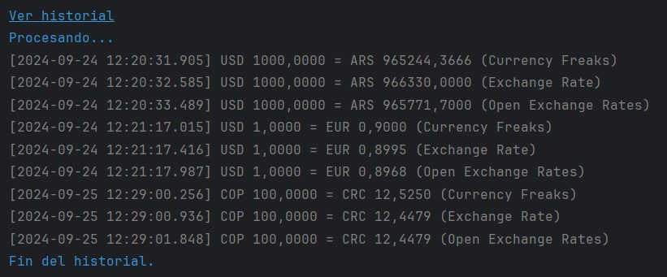

<h1 align="center">Conversor de Monedas</h1>

 

## Índice de Contenidos:
---
- [Contexto](#contexto)
- [Guía de Usuario](#guía-de-usuario)
- [Guía de Instalación](#guía-de-instalación)
- [Autor](#autor)
- [Licencia](#licencia)
- [Agradecimientos](#agradecimientos)
- [Documentos Complementarios](#documentos-complementarios)

## Contexto
---
Conversor de Monedas es una aplicación desarrollada en Java con el entorno IntelliJ para el Challenge del curso Java Orientado a Objetos de ONE + Alura Latam. Ha sido manufacturada por su autor (sin ayuda de IA) en Septiembre de 2024.

&#8593; <a href="#readme-indice">Índice</a> &#8593; <a href="#readme-inicio">Inicio</a> &#8593;

## Guía de Usuario
---
Esta aplicación permite convertir un determinado importe de una moneda a otra. Para ello, accede a las cotizaciones on-line de tres proveedores de cambio y luego recomienda el más conveniente. 

Si bien son propuestas siete monedas, en realidad es posible utilizar cualquiera del universo definido por la estandarización ISO 4217. Para más información: https://en.wikipedia.org/wiki/ISO_4217

Como extra, almacena las consultas realizadas en un archivo <code>historial.txt</code> que puede ser consultado desde la misma aplicación o por cualquier editor de texto.

A continuación, unas muestras de su interfaz:

<table style="border:0">
<tr>
<td style="text-align: center; vertical-align: center;"></td>
<td style="text-align: center; vertical-align: center;"></td>
</tr>
<tr>
<td style="text-align: center; vertical-align: center;" colspan="2"></td>
</tr>
<tr>
<td style="text-align: center; vertical-align: center;"></td>
<td style="text-align: center; vertical-align: center;"></td>
</tr>
</table

&#8593; <a href="#readme-indice">Índice</a> &#8593; <a href="#readme-inicio">Inicio</a> &#8593;

## Guía de Instalación
---
Simplemente se requiere clonar este proyecto en el repositorio local, y luego ejecutarlo con un IDE acorde (como IntelliJ, Eclipse, etc) desde el método <code>main</code> de la clase <code>Principal</code>.

Dado que la aplicación accede a Internet para ejecutar APIs, es importante asegurar que tanto antivirus como cortafuegos no impidan dicho comportamiento.

## Autor
---
César es alumno de Alura. Inició su formación en Junio de 2024 dentro del plan Oracle Next Education para Latinoamérica. Tiene 54 años y es nacido en Buenos Aires.

&#8593; <a href="#readme-indice">Índice</a> &#8593; <a href="#readme-inicio">Inicio</a> &#8593;

## Licencia 
---
Licencia BSD Zero Clause (0BSD) detallada en <code>LICENSE.txt</code> en la raíz del repositorio. Más información en https://opensource.org/license/0bsd

&#8593; <a href="#readme-indice">Índice</a> &#8593; <a href="#readme-inicio">Inicio</a> &#8593;

## Agradecimientos 
---
* Generador de logotipo : https://openai.com/
* Generador de favicon : https://favicon.io/

&#8593; <a href="#readme-indice">Índice</a> &#8593; <a href="#readme-inicio">Inicio</a> &#8593;

## Documentos Complementarios
---
* Clonar un repositorio de GitHub : https://docs.github.com/es/repositories/creating-and-managing-repositories/cloning-a-repository
* Códigos de monedas ISO 4217 : https://en.wikipedia.org/wiki/ISO_4217
* API Currency Feaks : https://currencyfreaks.com/#Latest
* API Exchange Rate : https://www.exchangerate-api.com/docs/standard-requests
* API Open Exchange Rates : https://docs.openexchangerates.org/reference/latest-json

&#8593; <a href="#readme-indice">Índice</a> &#8593; <a href="#readme-inicio">Inicio</a> &#8593;
